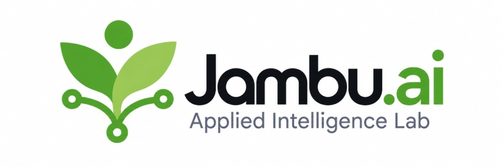

# gpu

Temporary GPU runtimes that stop billing when the work stops.

You declare the model and how long it may live. `gpu` provisions a machine, starts the model server, and runs your job against it. Shutdown happens on the instance, so closing the laptop does not leave the GPU billing.

Vast.ai is the first provider. Another provider is a new adapter. The lifecycle rule stays the same.

## Run

```bash
pip install jambu-gpu

cd your-experiment
gpu init --model empero-ai/Qwythos-9B-v2
export VAST_API_KEY=...

gpu validate
gpu setup
gpu run python experiment.py
```

When you are finished, `gpu destroy`. If you walk away, the idle timeout does it.

The API key is read from the environment, a project `.env`, or `~/.jambu/credentials`. It never goes in the manifest.

## Declare

```yaml
gpu_runtime:
  provider: {name: vast}
  model_profile: qwythos-9b
  lifecycle:
    idle_timeout: 15m
    max_lifetime: 6h
  budget:
    max_hourly_cost_usd: 1.50
```

The file is `jambu.yaml`. This tool reads only the `gpu_runtime:` key, so other Jambu tools can share the same file. A full example is [`jambu.example.yaml`](jambu.example.yaml).

## Docs

- [Commands, workloads, and agents](docs/USAGE.md)
- [Every config field](docs/CONFIG.md)
- [Choosing a model](docs/CHOOSING_A_MODEL.md)
- [How shutdown works](docs/LIFECYCLE.md)
- [Adding a provider](docs/ADDING_A_PROVIDER.md)
- [Contributing](CONTRIBUTING.md)

## License

[MIT](LICENSE).

<p align="center">
  <a href="https://jambu.ai">
    
  </a>
</p>
